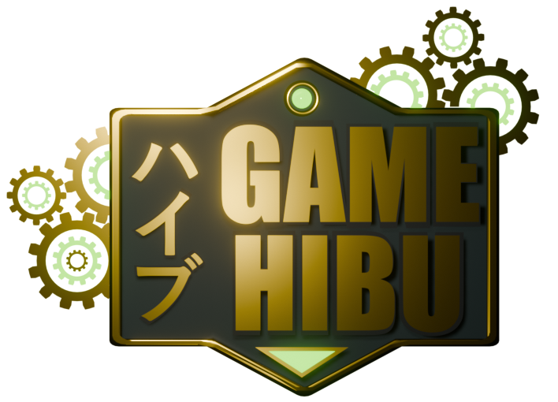

# Game Hibu



Game Hibu is an engaging and dynamic team project designed to showcase our potential skills. This project showcases a blend of creativity, innovative design, and robust functionality connecting an API with a Frontend developed to show Free to Play Games.

We deployed the App on Vercel so you can check it here:
<https://game-haibu.vercel.app/>

## 🚀 Features

- **UI/UX**: [Navigation like inside a Videogame's Menu.]
- **Custom Artwork**: [Custom 3D logo and buttons, palette and design.]
- **Dynamic Mechanics**: [Explore a big videogame database and it's details like if you were in a videogame menu.]
- **Multiplatform Compatibility**: [Desktop, tablet and mobile. All Responsive.]

## 🛠️ Technologies Used

- **Languages**: [HTML, CSS, JavaScript.]
- **Frameworks / Libraries**: [Vue.js, Vite, Tailwind CSS, Pinia.]
- **Tools**: [VSCode, Photoshop, Blender, Figma.]
- **Version Control**: [Git, GitHub.]

## 📂 Project Structure

```
Game-Hibu/
├── assets/            # App assets like images, etc.
├── src/               # Source code.
│   ├── components/    # Reusable UI components.
├── public/            # Resourses stored to show.
│   ├── buttons/       # Images of some assets.
└── README.md          # Project overview.
```

## 🎮 How to Use:

1. Clone the repository:
   ```bash
   git clone https://github.com/kanarath/Game-Hibu.git
   ```
2. Navigate to the project folder:
   ```bash
   cd Game-Hibu
   ```
3. Install dependencies:
   ```bash
   npm install  # or the relevant command for your tech stack
   ```
4. Run the Web App:
   ```bash
   npm start  # or the relevant command for your tech stack
   ```


## 📞 Contact

For any inquiries or collaboration opportunities, please reach out:

- **Email**: [gerard.montero.s@gmail.com.com](mailto:gerard.montero.s@gmail.com.com)
- **LinkedIn**: [Gerard Montero Sellares](https://www.linkedin.com/in/gerard-montero-sellares-3005499a/)
- **Portfolio**: [Gerard Montero Sellares](https://www.gerardms.com)

---

_This project is part of my portfolio. If you like it, feel free to give it a ⭐ on [GitHub](https://github.com/Kanarath/Game-Hibu)!_

---

 


_Este es un proyecto de estudiante creado en [CodeOp](http://codeop.tech), un bootcamp de desarrollo front-end en Barcelona._

